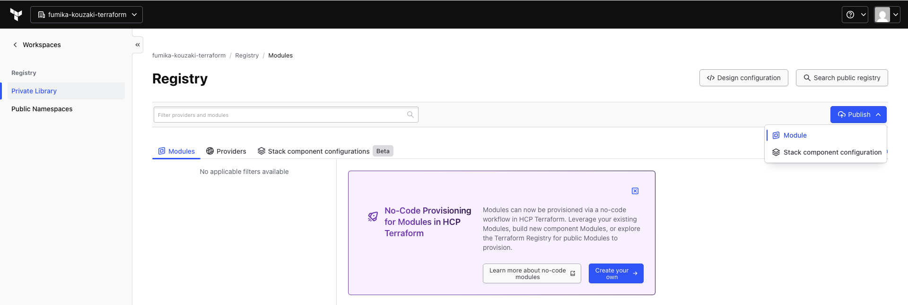
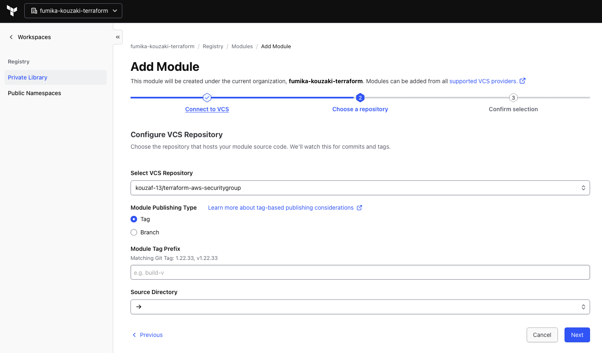
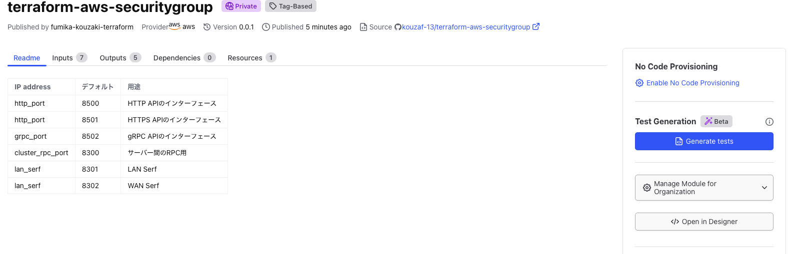
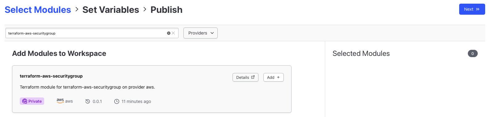
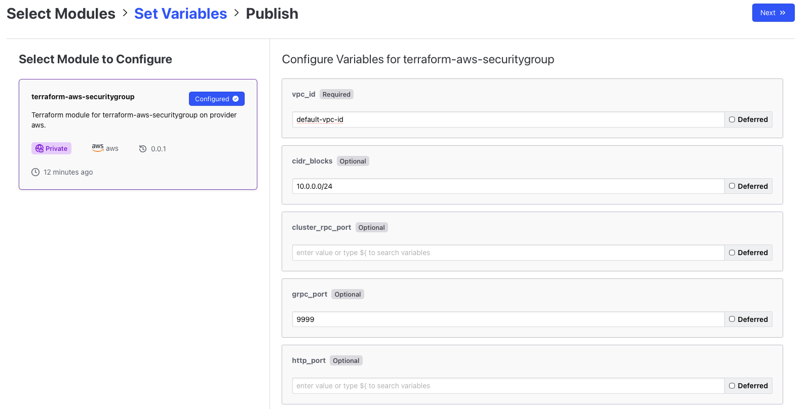
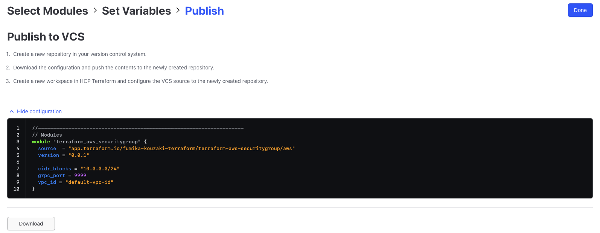
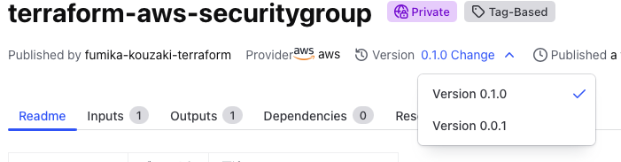

# Private Module Registry を試す

Terraform には DRY(Don't Repeat Yourself)を実現するために共通処理のコードをモジュール化する機能があります。OSS でも利用が可能ですが Git などのレポジトリから取得するか[Public Module Registry](https://registry.terraform.io/)から取得する方法が用意されています。

Enterprise 版では Organization ごとにプライベートな Module Registry を持つことが出来ます。これを利用することでチームだけに限定した Module のレジストリを介してソースコードを再利用できます。

## モジュールを作る

まず Module を作っていきましょう。モジュールは TFE で対応しているコードレポジトリ上に作っていきます。まずは GitHub 上にレポジトリを作ります。

```
GitHubのアカウントに"terraform-aws-securitygroup"という名前のレポジトリを作ってください。
```

レポジトリ名は必ず`terraform-<PROVIDER_NAME>-<MODULE_NAME>`という形にする必要があります。

次に必要なファイルを作っていきます。

```shell
$ mkdir path/to/tf-workshop/terraform-aws-securitygroup
$ cd path/to/tf-workshop/terraform-aws-securitygroup
$ touch README.md main.tf variables.tf output.tf
```

`README.md`を以下のように編集します。

<details>
	<summary>README.md</summary>

```
| IP address      | デフォルト | 用途 |
| --------------- |----- | --- | 
| http_port | 8500 | HTTP APIのインターフェース | 
| http_port | 8501 | HTTPS APIのインターフェース|  
| grpc_port | 8502 | gRPC APIのインターフェース |  
| cluster_rpc_port | 8300 | サーバー間のRPC用 | 
| lan_serf | 8301 | LAN Serf | 
| lan_serf | 8302 | WAN Serf | 
```

</details>

`main.tf`を以下のように編集してください。

<details>
	<summary>main.tf</summary>

```hcl
resource "aws_security_group" "consul_security_group" {
  name        = "consul_security_group"
  description = "Consul Sercuriy Group"
  vpc_id      = var.vpc_id

  ingress {
    protocol    = "tcp"
    cidr_blocks = var.cidr_blocks
    from_port   = var.http_port
    to_port     = var.http_port
  }

  ingress {
    cidr_blocks = var.cidr_blocks
    protocol    = "tcp"
    from_port   = var.https_port
    to_port     = var.https_port
  }

  ingress {
    cidr_blocks = var.cidr_blocks
    protocol    = "tcp"
    from_port   = var.grpc_port
    to_port     = var.grpc_port
  }

  ingress {
    cidr_blocks = var.cidr_blocks
    protocol    = "tcp"
    from_port   = var.cluster_rpc_port
    to_port     = var.cluster_rpc_port
  }

  ingress {
    cidr_blocks = var.cidr_blocks
    protocol    = "tcp"
    from_port   = var.lan_serf
    to_port     = var.lan_serf
  }

  egress {
    cidr_blocks = ["0.0.0.0/0"]
    protocol    = "-1"
    from_port   = 0
    to_port     = 0
  }

}
```
</details>


次に以下のように`variables.tf`を編集します。

<details>
	<summary>variables.tf</summary>

```hcl
variable "vpc_id" {}
variable "http_port" {
  default = "8500"
}
variable "https_port" {
  default = "8501"
}
variable "grpc_port" {
  default = "8502"
}
variable "cluster_rpc_port" {
  default = "8600"
}
variable "lan_serf" {
  default = "8301"
}
variable "cidr_blocks" {
  type     = list(string)
  default = ["0.0.0.0/0"]
}
```
</details>

最後に以下のように`output.tf`を編集します。

<details>
	<summary>output.tf</summary>

```hcl
output "http_port" {
  value = var.http_port
}

output "https_port" {
  value = var.https_port
}

output "grpc_port" {
  value = var.grpc_port
}

output "cluster_rpc_port" {
  value = var.cluster_rpc_port
}

output "lan_serf" {
  value = var.lan_serf
}
```
</details>

これでモジュール作りは終了です。GitHub にコミットしましょう。

```shell
$ git init 
$ git add .
$ git remote add origin https://github.com/tkaburagi/terraform-aws-securitygroup.git
$ git commit -m "first commit"
$ git tag -a 0.0.1 -m "v 0.0.1" 
$ git push origin 0.0.1 master
```

TFE の Private Module Registry のいいところはバージョン管理ができ、いつでも複数バージョンから選択できる点です。Git の tag からバージョンを取得しています。

バージョニングは`x.x.x`のフォーマットでセマンティックバージョニングを行うのが良いでしょう。

## Module Registry の作成

それではコミットしたモジュールを TFE 上で公開してみます。公開範囲は Organization で、その中の Workspace であればどのコンフィグからも利用可能です。

<kbd>
  
</kbd>

トップ画面から`Registry`を選択します。（まだ何もリストされていないはずです) `Publish`から`Module`を選択します。

<kbd>
  
</kbd>

次の画面で先ほどのレポジトリを指定します。Next へ進み、モジュール名とプロバイダ名を入力し、`Publish Module`を押してください。これでモジュールの公開は終了です。

<kbd>
  
</kbd>

上記のようなサマリー画面が見えるはずです。README、変数のインプットやバージョンなどの情報が確認出来ます。

## Module Registry の利用

このモジュールを使ってみます。先ほど作成したモジュールにおいて、右側にある`Open in Designer`をクリックします。

`Open in Designer`はモジュールを利用するための設定を行うためのエンタープライズ機能です。

<kbd>
  
</kbd>

先ほど追加したモジュールが出てくるはずなので`Add module`をクリックして、`Next`をクリックして下さい。

なお、複数のモジュールを組み合わせて使う際はここから複数選択して、まとめてコンフィグレーションを行うことが出来ます。

<kbd>
  
</kbd>

変数の設定画面が出てくるはずです。ここではインプットに必要な変数を自動で検出して GUI 上で設定することが出来ます。この際、`variables.tf`で`default`が設定されているものは`OPTIONAL`、設定されていないものは`REQUIRED`となり、設定漏れを防ぐことが出来て便利です。

今回実際 Apply は行わないので適当な値を入れて`Next`をクリックして下さい。

<kbd>
  
</kbd>

コードが生成されるはずです。これをコピーして既存のコードに利用してもいいですし、ダウンロードして新規のコンフィグレーションを立ち上げても OK です。このコードはここでしか取得出来ないので何らかの形で残しておきましょう。

`Done`をクリックして終了します。

以上で一連の使い方は終了ですが、余力のある方はバージョンアップをやってみましょう。

## Module のバージョンアップ

バージョンを指定して Module を利用出来ることはエンタープライズ版のメリットのうちの一つです。`main`, `variables`, `output`をそれぞれ以下のように編集します。

`main.tf`

```hcl
  ingress {
    cidr_blocks = var.cidr_blocks
    protocol    = "tcp"
    from_port   = var.wan_serf
    to_port     = var.wan_serf
  }
```

`variables.tf`

```hcl
variable "wan_serf" {
  default = "8302"
}
```

`output.tf`

```hcl
output "wan_serf" {
  value = var.wan_serf
}
```

コミットしてみましょう。

```shell
$ git add .
$ git commit -m "added wan feature"
$ git tag -a 0.1.0 -m "v 0.1.0"
$ git push origin 0.1.0 master
```

TFE の画面に戻り`Modules`をクリックしてモジュールの`Details`を選ぶとバージョンが`0.1.0`にアップしていることがわかるでしょう。

また`Versions`のボタンから複数バージョンを確認することが出来ます。

<kbd>
  
</kbd>

実際に作成する際もこれらのバージョンから選択してモジュールを使っていくことになります。

## 参考リンク

* [Terraform Registry](https://www.terraform.io/docs/registry/index.html)
* [Private Module Registry](https://www.terraform.io/docs/cloud/registry/index.html)
