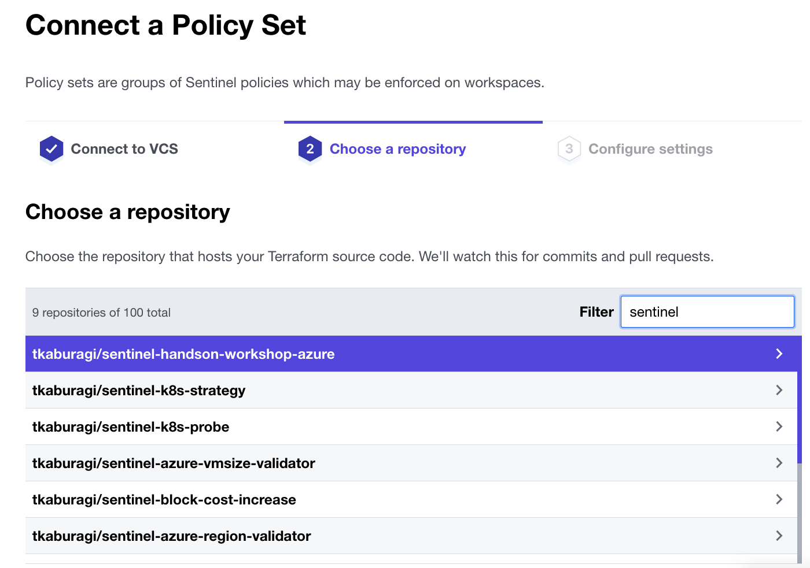

# Sentinel による Policy as Code

Terraform は便利なツールですが、多くのユーザが利用し大規模な運用になるとガバンナンスをきかせユーザの行動を制御することが運用上課題となります。有償版では HashiCorp が開発する[Sentinel](https://www.hashicorp.com/sentinel)というフレームワークを利用し、ポリシーを定義することができます。

定義できるポリシーは多岐に渡りますが、下記のような一例としてユースケースがあります。

* Terrafrom 実行時間の制御
* AZ/Region の制約
* タグの確認
* CIDR やネットワーク設定の確認
* 特定リソースの利用禁止

## Sentinel コードの作成
それではまずは Sentinel を利用するための設定を行います。Sentinel は最低限二つのファイルが必要です。一つは`sentinel.hcl`、もう一つは`<POLICYNAME>.sentinel`です。

```
GitHub上に`sentinel-handson-workshop`という名前のパブリックレポジトリを作成してください。
```

```shell
$ cd path/to/tf-workspace
$ mkdir sentinel-handson-workshop
$ cd sentinel-handson-workshop
```

以下の二つのファイルを追加します。

* 全クラウド共通のファイル (sentinel.hcl)

```shell
$ cat <<EOF > sentinel.hcl
policy "first-policy" {
    enforcement_level = "hard-mandatory"
}
EOF
```

* クラウドごとに変化するファイル (first-policy.sentinel)

```
WIP
```

<details><summary>GCPの場合はこちら</summary>

```
import "tfplan/v2" as tfplan

mandatory_labels = [
	"ttl",
]

instances = filter tfplan.resource_changes as _, rc {
	rc.mode is "managed" and
		rc.type is "google_compute_instance"
}

tags = instances["google_compute_instance.vm_instance[0]"]["change"]["after"]["labels"]

main = rule {
	all mandatory_labels as t {
		tags contains t
	}
}
```
</details>

<details><summary>Azureの場合はこちら</summary>

```
import "tfplan/v2" as tfplan

mandatory_tags = [
  "ttl",
]

instances = filter tfplan.resource_changes as _, rc {
  rc.mode is "managed" and
    rc.type is "azurerm_virtual_machine"
}

tags = instances["azurerm_virtual_machine.main[0]"]["change"]["after"]["tags"]

main = rule {
  all mandatory_tags as t {
    tags contains t
  }
}
```
</details>


このようになっていれば OK です。

```
.
├── sentinel-handson-workshop
│   ├── first-policy.sentinel
│   └── sentinel.hcl
└── tf-handson-workshop
    ├── main.tf
    └── variables.tf
```

`sentinel.hcl`のファイルは実際のポリシーが定義されているコードの設定を行います。`enforcement_level`を定義し、そのポリシーの強制度合いを設定します。

* soft-mandatory
	* ポリシーに引っかかりエラーになった時にそれをオーバーライドして実行を許可するか、拒否するかを選択できるモード
* hard-mandatory
	* ポリシーに引っかかったら必ず実行を拒否するモード
* advisory
	* 実行は許可するが、警告を出すモード

`first-policy.sentinel`のファイルは実際のポリシーコードです。ここの例は全てのインスタンスに対してタグがついているかを確認しています。

それではこれを GitHub にプッシュしてみます。

```shell
$ echo "# sentinel-handson-workshop" >> README.md
$ export GITURL=<YOUR_GIT_REPO_URL>
$ git init
$ git add .
$ git commit -m "first commit"
$ git branch -M main
$ git remote add origin ${GITURL}
$ git push -u origin main
```

## TFC の設定
次に TFC 側の設定です。トップ画面の一番上のタブから`Settings`を選択し、

<kbd>
  
</kbd>

`Policy Sets`を選び`Connect a new Policy Set`をクリックします。

<kbd>
  
</kbd>

`Connect a Policy Set`で先程作った`sentinel-handson-workshop`のレポジトリを選択します。

<kbd>
  
</kbd>

次の画面で以下のように入力してください。名前などは任意で構いません。**workspace を選んだら ADD WORKSPACE を押すのを忘れないでください。**

<kbd>
  
</kbd>

## ポリシーを試してみる

それでは実行してみましょう。ワークスペースの`Actions` -> `Start a New Plan` を選択し、Run をキックします。

<kbd>
  
</kbd>

前回と違い Policy Check のワークフローが追加されていることがわかります。

<kbd>
  
</kbd>

程なくするとポリシーチェックが開始されエラーになるでしょう。

次にコードを修正し、再度コミットしてみます。`path/to/tf-handson-workshop/main.tf`のコードを以下のように修正してください。

```hcl
terraform {
}

provider "aws" {
  access_key = var.access_key
  secret_key = var.secret_key
  region = var.region
}

resource "aws_instance" "hello-tf-instance" {
  ami = var.ami
  count = var.hello_tf_instance_count
  instance_type = var.hello_tf_instance_type
  tags = {
    owner = "me"
    ttl   = "100"
  }
}
```

<details><summary>GCPの場合はこちら</summary>

```
terraform {
}

provider "google" {
  credentials = var.gcp_key
  project     = var.project
  region      = var.region
}

resource "google_compute_instance" "vm_instance" {
  name = "terraform-instance-${count.index}"
  machine_type = var.machine_type
  count = var.hello_tf_instance_count
  zone = "asia-northeast1-a"
  labels = {
    owner = "me",
    ttl   = "100"
  }
  boot_disk {
    initialize_params {
      image = var.image
    }
  }

  network_interface {
    # A default network is created for all GCP projects
    network       = "default"
    access_config {
    }
  }
}
```
</details>

<details><summary>Azureの場合はこちら</summary>

```hcl
terraform {
}

provider "azurerm" {
  client_id = var.client_id
  tenant_id = var.tenant_id
  subscription_id = var.subscription_id
  client_secret = var.client_secret
  features {}
}

resource "azurerm_virtual_machine" "main" {
  name                  = "my-vm-${count.index}"
  count = var.hello_tf_instance_count
  location              = var.location
  resource_group_name   = azurerm_resource_group.example.name
  network_interface_ids = [azurerm_network_interface.example.*.id[count.index]]
  vm_size               = var.vm_size

  os_profile {
    computer_name  = "hostname"
    admin_username = "vmadmin"
    admin_password = var.admin_password
  }
  os_profile_linux_config {
    disable_password_authentication = false
  }
  tags = {
    owner = "me",
    ttl   = "100"
  }
  storage_image_reference {
    publisher = "Canonical"
    offer     = "UbuntuServer"
    sku       = "16.04-LTS"
    version   = "latest"
  }
  storage_os_disk {
    name              = "my-osdisk-${count.index}"
    caching           = "ReadWrite"
    create_option     = "FromImage"
    managed_disk_type = "Standard_LRS"
  }
}

resource "azurerm_resource_group" "example" {
  name     = "my-group"
  location = var.location
}


resource "azurerm_virtual_network" "example" {
  name                = "my-network"
  address_space       = ["10.0.0.0/16"]
  location            = var.location
  resource_group_name   = azurerm_resource_group.example.name
}

resource "azurerm_subnet" "example" {
  name                 = "my-subnet"
  resource_group_name   = azurerm_resource_group.example.name
  virtual_network_name = azurerm_virtual_network.example.name
  address_prefix       = "10.0.2.0/24"
}

resource "azurerm_network_interface" "example" {
  name                = "my-nw-interface-${count.index}"
  count = var.hello_tf_instance_count
  location            = var.location
  resource_group_name   = azurerm_resource_group.example.name

  ip_configuration {
    name                          = "my-ip-config"
    subnet_id                     = azurerm_subnet.example.id
    private_ip_address_allocation = "Dynamic"
  }

  tags = {
    environment = "payground"
  }
}
```
</details>

```shell
$ git add main.tf
$ git commit -m "added tags"
$ git push
```

再度ワークスペースの Runs の中から最新の実行を選んでください。次はポリシーチェックをクリアし、Apply できるはずです。`confirm & apply`をクリックして Apply してみましょう。

Apply が成功したら念の為インタンスにタグが付与されていることも確認しておきましょう。(GCP/Azure の場合は Web ブラウザから確認してください。)

```console
$ aws ec2 describe-instances --query "Reservations[].Instances[].{InstanceId:InstanceId,State:State,Tags:Tags}"
[
    {
        "InstanceId": "i-0561854e3727d3704",
        "State": {
            "Code": 16,
            "Name": "running"
        },
        "Tags": [
            {
                "Value": "me",
                "Key": "owner"
            },
            {
                "Value": "100",
                "Key": "ttl"
            }
        ]
    }
]
```

これで最初の Sentinel は終了です。ちなみにタグは有無だけではなく特定のタグがない場合を弾くなど、さらに細かく設定することもできます。

## Sentinel Simulator

Sentinel で都度実際に実行して確認するのではなく`Sentinel Sumilator`を利用してテストを実施するのが普通です。テストには sentinel cli が必要なので[こちらから](https://docs.hashicorp.com/sentinel/downloads)ダウンロードしてください。

`Apply`と`Test`の二つの機能があります。

### Apply

apply コマンドは Sentinel のコードをローカルで実行して試すコマンドです。ポリシーが意図通り動いていることや Syntax や文法にエラーがないかなどを事前に確認することができます。

Apply にはコンフィグレーションファイルというファイルが必要です。このファイルにはモックデータやテストケースを記述します。

サンプルを一つ作ってみます。

```shell
$ cd path/to/tf-workspace
$ mkdir simulator-sample
$ cd simulator-sample
```

```shell
$ cat <<EOF > sentinel.json
{
    "mock": {
        "time": {
            "hour": 9,
            "minute": 42
        }
    }
}
EOF
```

これがコンフィグレーションファイルとなります。この json は[time](https://docs.hashicorp.com/sentinel/imports/time)という Sentinel の標準で使える機能をモックし、仮のデータ`9時42分`として入れています。

次に Sentinel のコードを作ります。

```shell
$ cat <<EOF > foo.sentinel
import "time"

main = time.hour == 10
EOF
```

ここでは 10 時かどうかを確認しているため Apply するとエラーになるはずです。Apply して試してみましょう。

```console
$ sentinel apply foo.sentinel
Fail

Execution trace. The information below will show the values of all
the rules evaluated and their intermediate boolean expressions. Note that
some boolean expressions may be missing if short-circuit logic was taken.
```

コードを直して再度試してみます。`main = time.hour == 10` を`main = time.hour == 9`に変更して再度 Apply を実行します。

```console
$ sentinel apply foo.sentinel
Pass
```

データのモックには上記のように静的に指定する方法と Sentinel のコードで指定する方法があります。関数など JSON で静的にデータをモック出来ないタイプのデータがいくつかあります。ここでは関数を指定する方法を試してみます。

まずは関数を一つ作ってみます。ここでの Sentinel はポリシーの定義ではなくあくまでも関数でのモックデータの定義なので`main`は必要ありません。

```shell
$ cat <<EOF > mock-foo.sentinel
bar = func() {                         
    return "baz"
}
EOF
```

次に新しいコンフィグを作ってモックデータに先ほど Sentinel で作った関数を指定します。

```shell
$ cat <<EOF > sentinel-2.json
{
    "mock": {
        "foo": "mock-foo.sentinel" 
    }                                  
}                                                   
EOF
```

最後に新しいポリシーの定義ファイルを作ります。

```shell
$ cat <<EOF > foo-2.sentinel
import "foo"      
main = foo.bar() == "baz"
EOF
```

モックデータで定義されている`foo`を import して、関数`bar`を実行し、実行結果が`baz`であるかどうかを判定しています。

```console
$ sentinel apply -config=sentinel-2.json foo-2.sentinel
Pass
```

Apply すると Pass となるはずです。

### Terraform のデータを利用する

上記の例ではシンプルなデータを使って Simulator の機能を試してきました。実際の Terraform の環境ではモックのデータを自分で作るにはかなりの手間がかかります。TFC では Setinel 用にワークスペースの最新の構成をモックデータとして Export する機能が入っています。

<kbd>
  
</kbd>

Workspaces の Runs から最新の実行結果の`Plan finished`をクリックすると`Downloads Sentinel mocks`というボタンがあるのでこれをクリックしてモックデータをダウンロードし新しいフォルダを作ります。

```shell
$ cd path/to/tf-workspace
$ mkdir simulator-tf-sample simulator-tf-sample/testdata
$ touch simulator-tf-sample/sentinel.hcl simulator-tf-sample/tags-check.sentinel
$ tar xvfz path/to/run-gvXm387VP1VShKC1-sentinel-mocks.tar.gz  -C simulator-tf-sample/testdata
```

以下のような構造になれば OK です。

```console
simulator-tf-sample
├── sentinel.hcl
├── tags-check.sentinel
└── testdata
    ├── mock-tfconfig-v2.sentinel
    ├── mock-tfconfig.sentinel
    ├── mock-tfplan-v2.sentinel
    ├── mock-tfplan.sentinel
    ├── mock-tfrun.sentinel
    ├── mock-tfstate-v2.sentinel
    ├── mock-tfstate.sentinel
    └── sentinel.hcl
```

`testdata/`以下にコピーした 3 つのファイルには Sentinel で定義されたモックデータが入っています。全てを理解する必要はないので、これが最新の Terraform の状況をシミュレートしているとだけ押さえておけばとりあえず大丈夫です。

sentinel.hcl を以下のように記述してください。

```hcl
mock "tfconfig" {
  module {
    source = "testdata/mock-tfconfig.sentinel"
  }
}

mock "tfconfig/v1" {
  module {
    source = "testdata/mock-tfconfig.sentinel"
  }
}

mock "tfconfig/v2" {
  module {
    source = "testdata/mock-tfconfig-v2.sentinel"
  }
}

mock "tfplan" {
  module {
    source = "testdata/mock-tfplan.sentinel"
  }
}

mock "tfplan/v1" {
  module {
    source = "testdata/mock-tfplan.sentinel"
  }
}

mock "tfplan/v2" {
  module {
    source = "testdata/mock-tfplan-v2.sentinel"
  }
}

mock "tfstate" {
  module {
    source = "testdata/mock-tfstate.sentinel"
  }
}

mock "tfstate/v1" {
  module {
    source = "testdata/mock-tfstate.sentinel"
  }
}
```

ダウンロードした環境をシミュレートする Sentinel ファイルをモックデータとして指定しています。実際のポリシーコードではこの`tfconfig`, `tfplan`,`tfstate`を import してポリシーを定義しローカルで実行します。

一番最初に試したタグの有無をチェックするポリシーを使って試してみたいと思います。`tags-check.sentinel`を以下のように編集します。

```sentinel
WIP
```

<details><summary>GCPの場合はこちら</summary>

```sentinel
import "tfplan/v2" as tfplan

mandatory_labels = [
	"ttl",
]

instances = filter tfplan.resource_changes as _, rc {
	rc.mode is "managed" and
		rc.type is "google_compute_instance"
}

tags = instances["google_compute_instance.vm_instance[0]"]["change"]["after"]["labels"]

main = rule {
	all mandatory_labels as t {
		tags contains t
	}
}
```
</details>

<details><summary>Azureの場合はこちら</summary>

```sentinel
import "tfplan/v2" as tfplan

mandatory_tags = [
  "ttl",
]

instances = filter tfplan.resource_changes as _, rc {
  rc.mode is "managed" and
    rc.type is "azurerm_virtual_machine"
}

tags = instances["azurerm_virtual_machine.main[0]"]["change"]["after"]["tags"]

main = rule {
  all mandatory_tags as t {
    tags contains t
  }
}
```
</details>


`testdata/mock-tfplan.sentinel`を確認してみましょう。

```console
$ grep -A 4 -n labels  testdata/mock-tfplan-v2.sentinel
  "tags": {
24-               "owner": "me",
25-               "ttl":   "100",
26-             },
27-             "timeouts":         null,
--
208:              "tags.%": {
209-                "computed": false,
210-                "new":      "2",
211-                "old":      "",
212-              },
--
213:              "tags.owner": {
214-                "computed": false,
215-                "new":      "me",
216-                "old":      "",
217-              },
--
218:              "tags.ttl": {
219-                "computed": false,
220-                "new":      "100",
221-                "old":      "",
222-              },
--
243:              "volume_tags.%": {
244-                "computed": true,
245-                "new":      "",
246-                "old":      "",
247-              },
```

タグがついたデータが入っておりテストが通るはずです。

```console
$ sentinel apply tags-check.sentinel
Pass
```

最後にポリシーコードを変更して意図通り Fail するかを確認します。

```sentinel
WIP
```

<details><summary>GCPの場合はこちら</summary>

```sentinel
import "tfplan/v2" as tfplan

mandatory_labels = [
	"ttl",
  "test",
]

instances = filter tfplan.resource_changes as _, rc {
	rc.mode is "managed" and
		rc.type is "google_compute_instance"
}

tags = instances["google_compute_instance.vm_instance[0]"]["change"]["after"]["labels"]

main = rule {
	all mandatory_labels as t {
		tags contains t
	}
}
```
</details>

<details><summary>Azureの場合はこちら</summary>

```sentinel
WIP
```
</details>

実際のモックデータには入っていない`test`タグを必須タグとしてポリシーをセットしました。

```console
$ sentinel apply tags-check.sentinel
Execution trace. The information below will show the values of all
the rules evaluated. Note that some rules may be missing if
short-circuit logic was taken.

Note that for collection types and long strings, output may be
truncated; re-run "sentinel apply" with the -json flag to see the
full contents of these values.

The trace is displayed due to a failed policy.

Fail - tags.sentinel

tags.sentinel:15:1 - Rule "main"
  Value:
    false
```

意図通り`false`が返ってくるはずです。


## 参考リンク
* [Sentinel](https://www.hashicorp.com/sentinel)
* [Sentinel Docs](https://docs.hashicorp.com/sentinel/)
* [Sentinel Terraform](https://www.terraform.io/docs/cloud/sentinel/index.html)
* [Sentinel Language](https://docs.hashicorp.com/sentinel/language/)
* [Mocking Terraform Data](https://www.terraform.io/docs/cloud/sentinel/mock.html)
* [Sample Policies](https://github.com/hashicorp/terraform-guides/tree/master/governance)
* [Sample Policies](https://www.terraform.io/docs/cloud/sentinel/examples.html)
