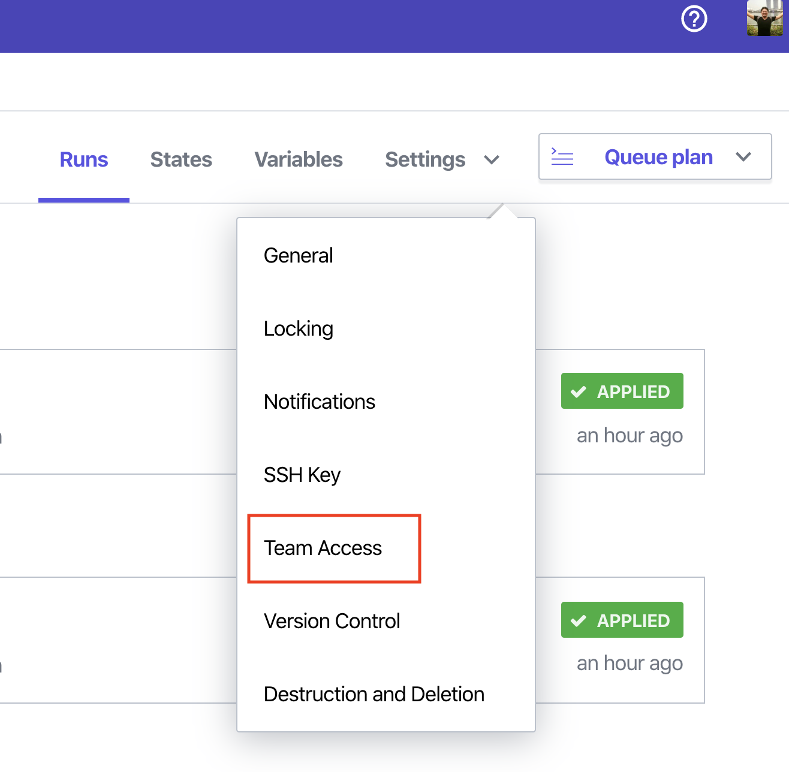
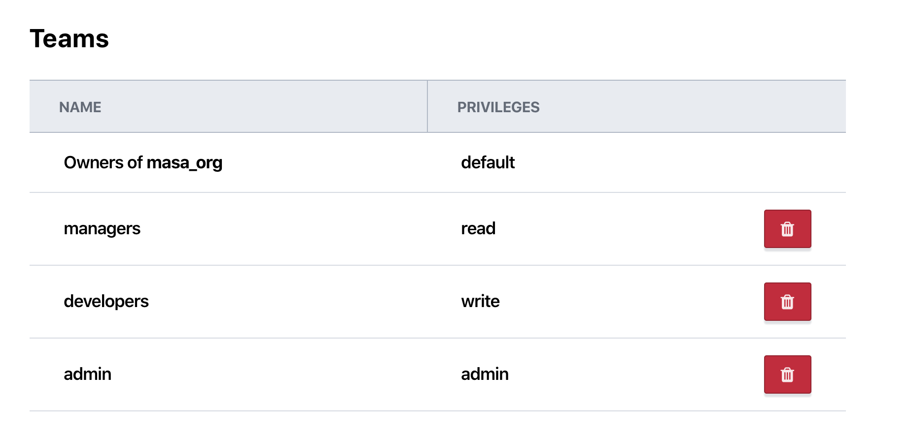
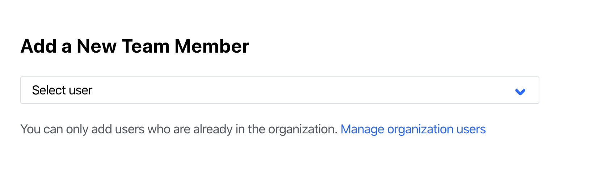

# Teams in Terraform cloud/enterpise

Terraform cloud free-tier (無料版)には Team という概念がありません。よって複数のメンバーで使用するときにアクセス制御をつける事ができません。

その問題を解決するために、Terraform cloud 及び Enterprise には**Roles / Team managerment**という機能が準備されています。
この機能は以下の Terraform offering で利用可能です。
- Terraform cloud team
- Terraform cloud team & governance
- Terraform Enterprise

Team に対する権限は Organization レベルと Workspace レベルの 2 段階で設定できます。

ここでのエクササイズでは、organization 及び Workspace に対して Team を作成し、アクセス権限を付与してみます。

## Organization レベルの Team の作成

まず、[Terraform cloud](https://app.terraform.io/)へアクセスし、Organization の**Setting >> Teams**へ行きます。

<kbd>
  
</kbd>

Team には以下のような 3 つの権限をつけることが出来ます。**ここでの権限は Organization レベルの権限であり、Workspace レベルの権限ではありません。**
- Managed Policies
- Manage workspaces
- Manage VCS setting

<kbd>
  
</kbd>

**Create a New Team**から以下の 3 つのチームを 1 つづつ作成します。

1. admin
   - admin には 3 つ全ての権限をつけて下さい。
2. developers
   - 権限は何もつけなくてよいです。（Organization レベルの権限は付与しない)
3. managers
   - 権限は何もつけなくてよいです。(Organization レベルの権限は付与しない)

## Workspace レベルの Team の作成

次に Workspace レベルの Team の作成を行います。

Workspace を開き、**Settings > Team Access**へナビゲートしてください。

<kbd>
  
</kbd>

ここで先程作成した Team に、以下のように Workspace レベルの Permissions を付与してください。

- admin
  - admin
- developers
  - write
- managers
  - read

以下のように表示されれば OK です。

<kbd>
  
</kbd>

この Permission については詳細は[ドキュメント](https://www.terraform.io/docs/cloud/users-teams-organizations/permissions.html)を参照いただければと思います。簡単にまとめますと：

- Read
  - State ファイルの参照
  - Run 履歴の参照
  - セキュア変数の参照
  - State ファイルに変更の加わる処理はできない
- Plan
  - Read 権限の全て
  - Run の作成（Plan の実行可、Apply の実行不可）
- Write
  - Plan 権限の全て
  - State ファイルへの変更（Apply の実行）
  - Run 実行の承認
  - セキュア変数の変更
  - Workspace の Lock/Unlock
- Admin
  - Write 権限の全て
  - Workspace の削除
  - Workspace へのメンバーの追加・変更
  - Workspace 設定（VCS など）の変更

となります。

## チームメンバーを Team にアサイン

Team が設定されたら、admins 権限のあるユーザーはチームメンバーを Team にアサインします。

既に Organization に追加されているユーザーであれば、**organization レベルの Settings >> Teams** から Team を選択し、**Add a New Team Member**でユーザーを追加します。

<kbd>
  
</kbd>

これからユーザーを追加する場合は、**organization レベルの Settings >> Users**の**Invite a user**ボタンからユーザーの Team を選択してインバイトします。

<kbd>
  
</kbd>

<kbd>
  
</kbd>

## まとめ

Terraform cloud free-tier では Workspace へのアクセスがあれば誰でも State ファイルへ変更（Apply の実効）が可能ですが、Terraform cloud paid 及び Enterprise では、様々な処理に対しアクセス制限を付けることができます。複数のチームメンバーに対し、それぞれ役割に応じた権限を割り当てることで、ルールに応じたワークフローを実現できるのではないでしょうか。

Team とアクセス制限を駆使して Terraform Cloud/Enterprise では RBAC（Role based access control)を実現します。
