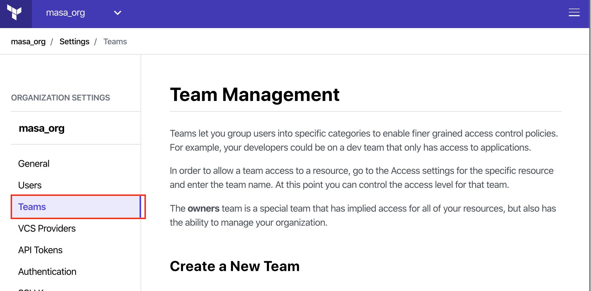
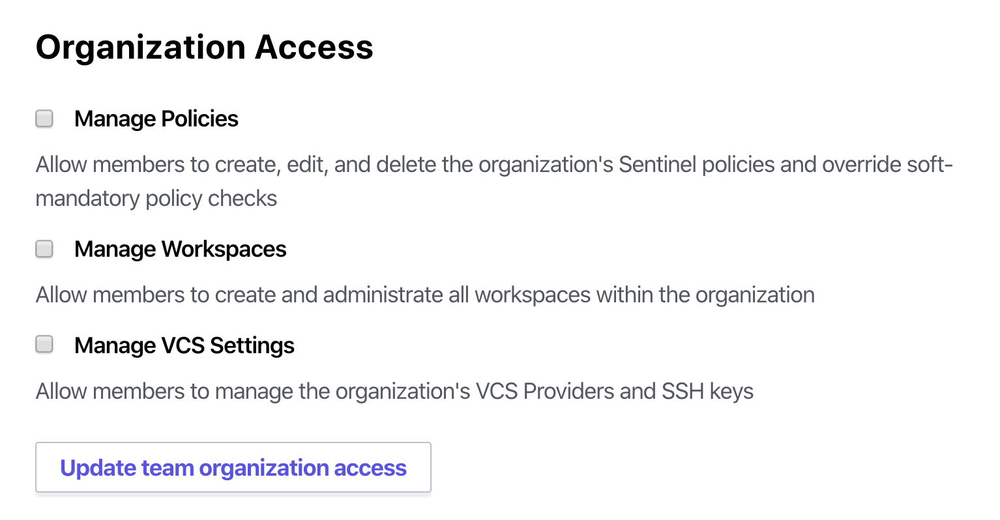
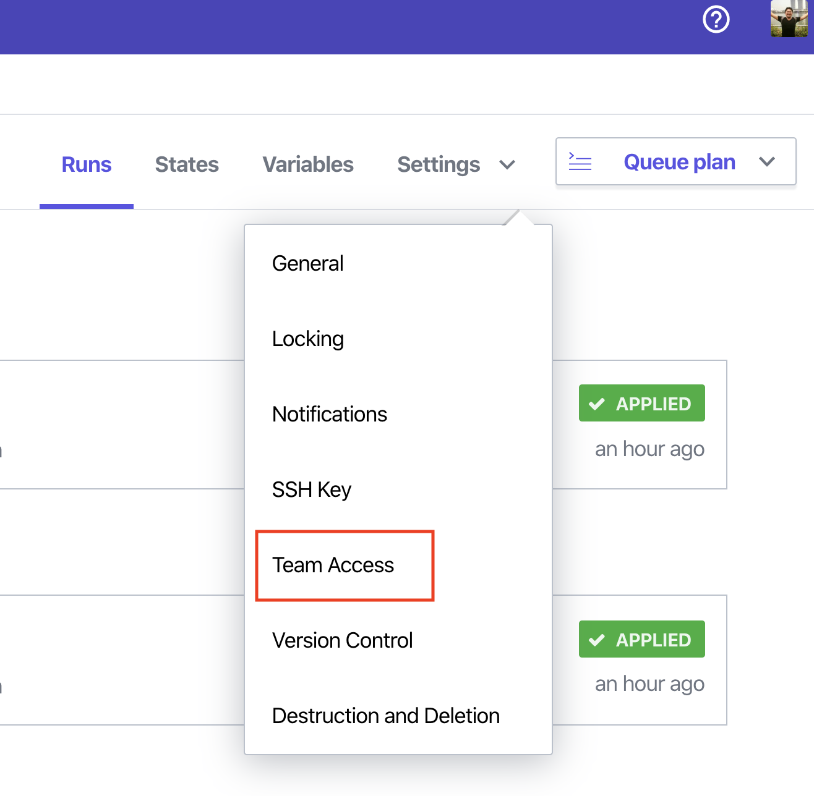
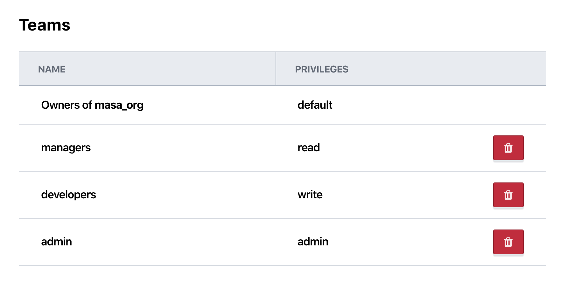
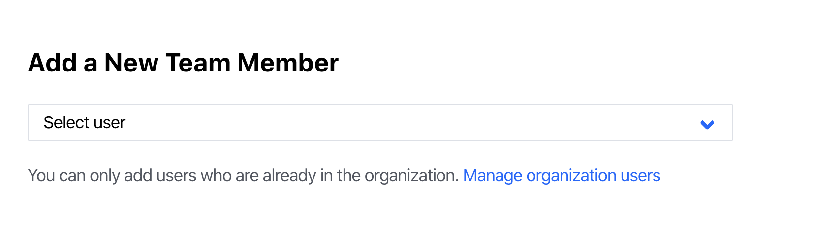
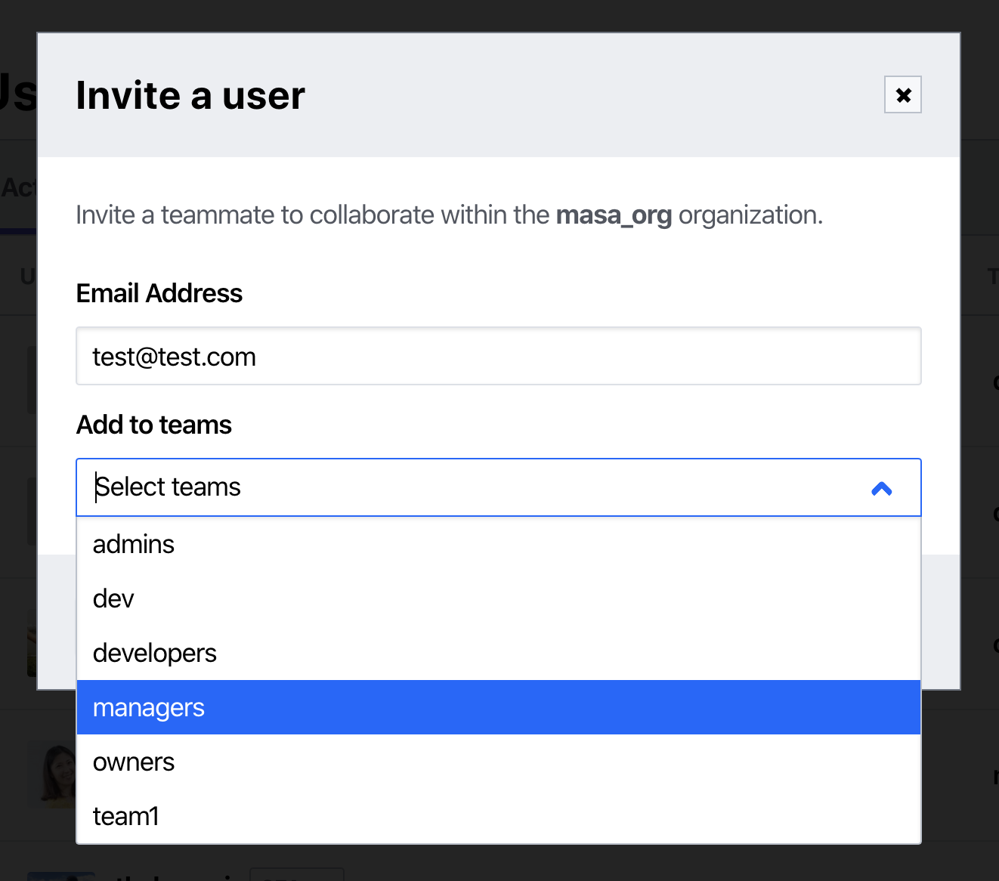

# Teams in Terraform Cloud/Enterprise

Terraform Cloud Free Tier（無料版）では Team 機能が利用できないため、複数メンバーで利用する際のアクセス制御は限定的です。

その問題を解決するために、Terraform Cloud の有償プランおよび Terraform Enterprise では **Roles / Team management** 機能が利用できます。

> ※プラン名は変更されることがあるため、最新の提供状況は Terraform Cloud の料金ページで確認してください。

Team に対する権限は Organization レベルと Workspace レベルの 2 段階で設定できます。

ここでのエクササイズでは、Organization および Workspace に対して Team を作成し、アクセス権限を付与してみます。

## Organization レベルの Team の作成

まず、[Terraform Cloud](https://app.terraform.io/)へアクセスし、Organization の **Settings > Teams** へ移動します。

<kbd>
  
</kbd>

Team には以下のような 3 つの権限を付与できます。**ここでの権限は Organization レベルの権限であり、Workspace レベルの権限ではありません。**
- Manage policies
- Manage workspaces
- Manage VCS settings

<kbd>
  
</kbd>

**Create a New Team**から以下の 3 つのチームを 1 つづつ作成します。

1. admin
   - admin には 3 つ全ての権限をつけて下さい。
2. developers
   - 権限は何もつけなくてよいです。（Organization レベルの権限は付与しない)
3. managers
   - 権限は何もつけなくてよいです。(Organization レベルの権限は付与しない)

## Workspace レベルの Team の作成

次に Workspace レベルの Team の作成を行います。

Workspace を開き、**Settings > Team Access**へナビゲートしてください。

<kbd>
  
</kbd>

ここで先程作成した Team に、以下のように Workspace レベルの Permissions を付与してください。

- admin
  - admin
- developers
  - write
- managers
  - read

以下のように表示されれば OK です。

<kbd>
  
</kbd>

この Permission の詳細は [公式ドキュメント](https://developer.hashicorp.com/terraform/cloud-docs/users-teams-organizations/permissions) を参照してください。簡単にまとめると：

- Read
  - State ファイルの参照
  - Run 履歴の参照
  - セキュア変数の参照
  - State ファイルに変更の加わる処理はできない
- Plan
  - Read 権限の全て
  - Run の作成（Plan の実行可、Apply の実行不可）
- Write
  - Plan 権限の全て
  - State ファイルへの変更（Apply の実行）
  - Run 実行の承認
  - セキュア変数の変更
  - Workspace の Lock/Unlock
- Admin
  - Write 権限の全て
  - Workspace の削除
  - Workspace へのメンバーの追加・変更
  - Workspace 設定（VCS など）の変更

となります。

## チームメンバーを Team にアサイン

Team が設定されたら、Admin 権限のあるユーザーがチームメンバーを Team にアサインします。

既に Organization に追加されているユーザーであれば、**organization レベルの Settings >> Teams** から Team を選択し、**Add a New Team Member**でユーザーを追加します。

<kbd>
  
</kbd>

これからユーザーを追加する場合は、**organization レベルの Settings >> Users**の**Invite a user**ボタンからユーザーの Team を選択してインバイトします。

<kbd>
  
</kbd>

<kbd>
  
</kbd>

## まとめ

Terraform Cloud Free Tier では Workspace へのアクセスがあれば誰でも State ファイルへ変更（Apply の実行）が可能ですが、Terraform Cloud の有償プランおよび Enterprise では、さまざまな処理に対してアクセス制限を設定できます。複数のチームメンバーに対し、それぞれ役割に応じた権限を割り当てることで、ルールに応じたワークフローを実現できるのではないでしょうか。

Team とアクセス制限を組み合わせることで、Terraform Cloud/Enterprise で RBAC（Role-Based Access Control）を実現できます。
