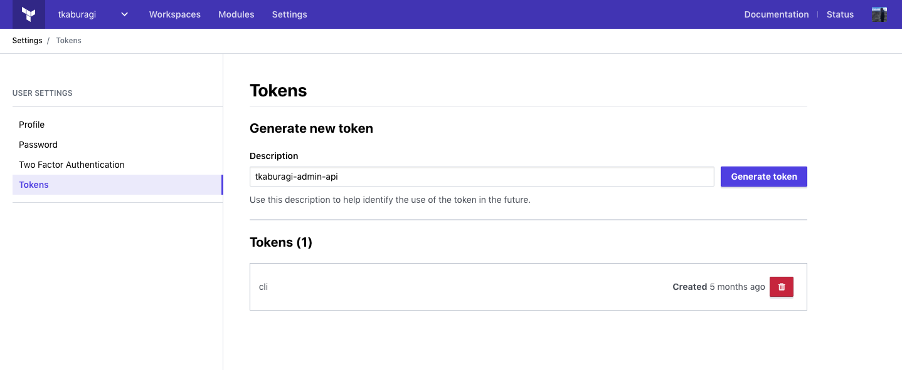
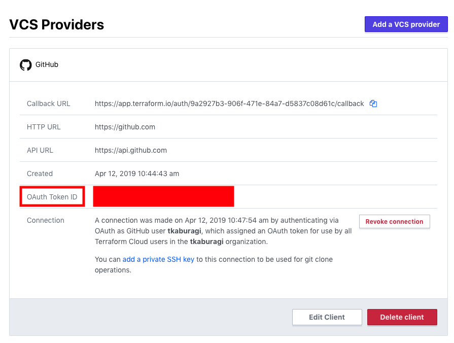

# Terraform Enterprise API を試す

ここまで GUI で操作を行ってきましたが、Terraform Cloud/Enterprise では API による操作も可能で、CI パイプラインなどの自動化ワークフローに組み込めます。

Terraform に関わる操作に加えてユーザ管理など様々な運用作業を API で実施できます。

**ここまでで実行したプロビジョニングが全て Destroy されていることを確認してこの手順を進めて下さい。**

## トークンを取得する

まず API を利用するにはトークンを取得する必要があります。

[ユーザセッティング](https://app.terraform.io/app/settings/tokens)の画面からトークンを作成します。

<kbd>
  
</kbd>


上記のように任意のトークンの名前を入力して、`Generate Token`をクリックしてください。

トークンが生成されるはずです。トークンはここでしか表示されないのでコピーして保存するかダウンロードをしてください。

トークンを生成したらテストしてみます。

```shell
$ export TF_TOKEN=<YOUR_TOKEN>

$ curl \
  --header "Authorization: Bearer $TF_TOKEN" \
  --header "Content-Type: application/vnd.api+json" \
  --request GET \
  https://app.terraform.io/api/v2/account/details | jq
```

`account/details`を実行し、以下のようにユーザ情報が出力されるはずです。

<details><summary>出力例</summary>

```json
{
  "data": {
    "id": "user-9szJo2sfxhVLevKp",
    "type": "users",
    "attributes": {
      "username": "tkaburagi",
      "is-service-account": false,
      "avatar-url": "https://www.gravatar.com/avatar/98f321325ba59b28d4af94339fb5e3e4?s=100&d=mm",
      "password": null,
      "v2-only": true,
      "enterprise-support": true,
      "is-site-admin": true,
      "is-sso-login": false,
      "two-factor": {
        "enabled": true,
        "verified": true
      },
      "email": "kabu@hashicorp.com",
      "unconfirmed-email": null,
      "has-git-hub-app-token": false,
      "permissions": {
        "can-create-organizations": true,
        "can-change-email": true,
        "can-change-username": true
      }
    },
    "relationships": {
      "authentication-tokens": {
        "links": {
          "related": "/api/v2/users/user-9szJo2sfxhVLevKp/authentication-tokens"
        }
      }
    },
    "links": {
      "self": "/api/v2/users/user-9szJo2sfxhVLevKp"
    }
  }
}
```
</details>

## Terraform の操作を API で行う

ここではワークスペース作成から実際のプロビジョニングを行ってみましょう。

### ワークスペース作成

まずはワークスペースを作成してみます。

Workspace の一覧はこちらです。

```shell
$ export TF_ORG=<YOUR_ORG_NAME>

$ curl \
  --header "Authorization: Bearer $TF_TOKEN" \
  --header "Content-Type: application/vnd.api+json" \
  --request GET \
  https://app.terraform.io/api/v2/organizations/${TF_ORG}/workspaces | jq -r ".data[].attributes.name"
  ```

次にワークスペースを作成します。VCS の章で作成した設定から GitHub の `OAUTH_TOKEN_ID` を取得します。トップ画面の `Settings` -> `VCS Providers` から値をコピーしてください。

<kbd>
  
</kbd>


```shell
$ export GITHUB_USERNAME=<YOUR_GITHUB_NAME>
$ export OAUTH_TOKEN_ID=<YOUR_OAUTH_TOKEN_ID>

$ cat << EOF > payload-workspace.json
{
  "data": {
    "attributes": {
      "name": "new-workspace",
      "terraform_version": "1.8.5",
      "working-directory": "",
      "vcs-repo": {
        "identifier": "${GITHUB_USERNAME}/terraform-workshop-jp",
        "oauth-token-id": "${OAUTH_TOKEN_ID}",
        "branch": "",
        "default-branch": true
      }
    },
    "type": "workspaces"
  }
}
EOF

$ curl \
  --header "Authorization: Bearer $TF_TOKEN" \
  --header "Content-Type: application/vnd.api+json" \
  --request POST \
  --data @payload-workspace.json \
  https://app.terraform.io/api/v2/organizations/${TF_ORG}/workspaces | jq
```

`organizations/${TF_ORG}/workspaces` を実行し、ワークスペースが作成されたことを確認します。ここで出力される `.data.id` の `ws-********` がワークスペース ID です。後で使うためメモしておいてください。

```shell
$ export WS_ID=<YOUR_WORKSPACE_ID>

$ curl \
  --header "Authorization: Bearer $TF_TOKEN" \
  --header "Content-Type: application/vnd.api+json" \
  --request GET \
  https://app.terraform.io/api/v2/organizations/${TF_ORG}/workspaces | jq -r ".data[].attributes.name"
  ```

```shell
new-workspace
handson-workshop
```

ワークスペースの情報を確認して、VCS 連携の設定などが正しく反映されているか確認してください。`organizations/${TF_ORG}/workspaces/new-workspace` がエンドポイントです。

```shell
$ curl \
  --header "Authorization: Bearer $TF_TOKEN" \
  --header "Content-Type: application/vnd.api+json" \
  --request GET \
  https://app.terraform.io/api/v2/organizations/${TF_ORG}/workspaces/new-workspace | jq
  ```

### 変数のセット

次に変数をセットします。変数のセットは JSON で定義した変数を`/vars`のエンドポイントに POST します。取得する時は同エンドポイントに GET します。

先ほど作ったワークスペースで試してみましょう。

```shell
$ curl \
  --header "Authorization: Bearer $TF_TOKEN" \
  --header "Content-Type: application/vnd.api+json" \
  --request GET \
  https://app.terraform.io/api/v2/vars\?filter%5Borganization%5D%5Bname%5D\=${TF_ORG}\&filter%5Bworkspace%5D%5Bname%5D\=new-workspace | jq
```

セットしたインスタンス数の値が見れる一方、`sensitive`としてセットした AWS のキーなどは`null`と表示されるでしょう。

それでは変数をセットしていきます。JSON で変数を設定する際に必要なパラメータは [Variables API](https://developer.hashicorp.com/terraform/cloud-docs/api-docs/variables) を参照してください。まずは `hello_tf_instance_count` です。

```shell
$ cat << EOF > payload-var.json
{
  "data": {
    "type": "vars",
    "attributes": {
      "key": "hello_tf_instance_count",
      "value": "1",
      "sensitive": false,
      "category": "terraform",
      "hcl": false,
      "description": null
    },
    "relationships": {
      "configurable": {
        "data": {
          "id": "${WS_ID}",
          "type": "workspaces"
        }
      }
    }
  }
}
EOF

$ curl \
  --header "Authorization: Bearer $TF_TOKEN" \
  --header "Content-Type: application/vnd.api+json" \
  --request POST \
  --data @payload-var.json \
  https://app.terraform.io/api/v2/vars
```

次に`hello_tf_instance_type`をセットします。

```shell
$ cat << EOF > payload-var.json
{
  "data": {
    "type": "vars",
    "attributes": {
      "key": "hello_tf_instance_type",
      "value": "t2.micro",
      "sensitive": false,
      "category": "terraform",
      "hcl": false,
      "description": null
    },
    "relationships": {
      "configurable": {
        "data": {
          "id": "${WS_ID}",
          "type": "workspaces"
        }
      }
    }
  }
}
EOF

$ curl \
  --header "Authorization: Bearer $TF_TOKEN" \
  --header "Content-Type: application/vnd.api+json" \
  --request POST \
  --data @payload-var.json \
  https://app.terraform.io/api/v2/vars
```

セットした変数を確認してみましょう。

```shell
$ curl \
  --header "Authorization: Bearer $TF_TOKEN" \
  --header "Content-Type: application/vnd.api+json" \
  --request GET \
  https://app.terraform.io/api/v2/vars\?filter%5Borganization%5D%5Bname%5D\=${TF_ORG}\&filter%5Bworkspace%5D%5Bname%5D\=new-workspace | jq
```

残りの変数をセットしていきます。API だけでも登録できますが、ここでは手順短縮のため `tfe` Provider を使ってまとめて設定します。

ここでは API とは別手段として、Terraform の `tfe` Provider を使って変数をまとめて設定してみます。`tfe` Provider については [Terraform Registry](https://registry.terraform.io/providers/hashicorp/tfe/latest/docs) を参照してください。

残りの `access_key`, `secret_key`, `ami`, `region`, `CONFIRM_DESTROY` をまとめてセットしていきます。

```shell
$ mkdir tfe-provider

$ cat << EOF > tfe-provider/main.tf
terraform {
  required_version = ">= 1.5.0"
}

provider "tfe" {
  hostname = var.hostname
  token    = var.token
}

resource "tfe_variable" "aws_access_key" {
  key          = "access_key"
  value        = var.aws_access_key
  category     = "terraform"
  sensitive    = true
  workspace_id = var.workspace_id
}

resource "tfe_variable" "aws_secret_key" {
  key          = "secret_key"
  value        = var.aws_secret_key
  category     = "terraform"
  sensitive    = true
  workspace_id = var.workspace_id
}

resource "tfe_variable" "ami" {
  key          = "ami"
  value        = "ami-06d9ad3f86032262d"
  category     = "terraform"
  sensitive    = false
  workspace_id = var.workspace_id
}

resource "tfe_variable" "region" {
  key          = "region"
  value        = "ap-northeast-1"
  category     = "terraform"
  sensitive    = false
  workspace_id = var.workspace_id
}

resource "tfe_variable" "confirm_destroy" {
  key          = "CONFIRM_DESTROY"
  value        = "1"
  category     = "env"
  sensitive    = false
  workspace_id = var.workspace_id
}
EOF

$ cat << EOF > tfe-provider/variables.tf
variable "hostname" {
  default = "app.terraform.io"
}
variable "token" {}
variable "workspace_id" {
  default = "${TF_ORG}/new-workspace"
}
variable "aws_access_key" {}
variable "aws_secret_key" {}
EOF
```

`terraform plan & apply`してみましょう。

```shell
$ cd tfe-provider
$ terraform init
$ terraform plan
$ terraform apply -auto-approve
$ cd ..
```

`aws_access_key`, `aws_secret_key`, `token`の入力が必要です。`token`には Terraform Enterprise のトークンを入力します。

Apply が終了したら変数を確認してください。

```shell
$ curl \
  --header "Authorization: Bearer $TF_TOKEN" \
  --header "Content-Type: application/vnd.api+json" \
  --request GET \
  https://app.terraform.io/api/v2/vars\?filter%5Borganization%5D%5Bname%5D\=${TF_ORG}\&filter%5Bworkspace%5D%5Bname%5D\=new-workspace | jq
```

### プロビジョニングを実行

それでは最後にプロビジョニングと環境の削除をやってみます。

まず`/runs`エンドポイントでプランを作成しましょう。プランにはプランに含めるメッセージやワークスペースの ID などが必要です。

これを JSON で定義し、`runs`エンドポイントに POST することでプランが作成されます。

```shell
$ cat << EOF > payload-plans.json
{
  "data": {
    "attributes": {
      "is-destroy":false,
      "message": "This is an API Driven Run"
    },
    "type":"runs",
    "relationships": {
      "workspace": {
        "data": {
          "type": "workspaces",
          "id": "${WS_ID}"
        }
      }
    }
  }
}
EOF

$ curl \
  --header "Authorization: Bearer $TF_TOKEN" \
  --header "Content-Type: application/vnd.api+json" \
  --request POST \
  --data @payload-plans.json \
  https://app.terraform.io/api/v2/runs | jq > plan-response-body.json
```

これで Plan が開始されているはずです。`plan-response-body.json`の内容を確認してみてください。

以下の`workspaces/${WS_ID}/runs`で状態を確認してみましょう。

```shell
$ curl \
  --header "Authorization: Bearer $TF_TOKEN" \
  --header "Content-Type: application/vnd.api+json" \
  --request GET \
  https://app.terraform.io/api/v2/workspaces/${WS_ID}/runs | jq
```

以下のように何度か実行すると`status`のパラメータが変化しているでしょう。

```json
{
  "data": [
    {
      "id": "run-3YUm7dKKh6qHQo1y",
      "type": "runs",
      "attributes": {
        "actions": {
          "is-cancelable": false,
          "is-confirmable": true,
          "is-discardable": true,
          "is-force-cancelable": false
        },
        "canceled-at": null,
        "created-at": "2019-12-12T07:45:21.828Z",
        "has-changes": true,
        "is-destroy": false,
        "message": "This is an API Driven Run",
        "plan-only": false,
        "source": "tfe-api",
        "status-timestamps": {
          "planned-at": "2019-12-12T07:45:50+00:00",
          "planning-at": "2019-12-12T07:45:22+00:00",
          "plan-queued-at": "2019-12-12T07:45:22+00:00",
          "cost-estimated-at": "2019-12-12T07:45:55+00:00",
          "plan-queueable-at": "2019-12-12T07:45:21+00:00",
          "cost-estimating-at": "2019-12-12T07:45:50+00:00"
        },
        "status": "cost_estimated",
        "trigger-reason": "manual",
        "permissions": {
          "can-apply": true,
          "can-cancel": true,
          "can-discard": true,
          "can-force-execute": true,
          "can-force-cancel": true,
          "can-override-policy-check": false
        }
      },
```

上記の`id`のパラメータをメモして環境変数にセットします。

```shell
$ export RUN_ID=run-3YUm7dKKh6qHQo1y
```

Plan が終わったらプラン内容を確認します。先ほど取得した`plan-response-body.json`から Plan ID を取得しましょう。

```shell
$ export PLAN_ID=$(cat plan-response-body.json | jq -r '.data.relationships.plan.data.id')

$ curl \
  --header "Authorization: Bearer $TF_TOKEN" \
  --header "Content-Type: application/vnd.api+json" \
  --request GET \
  https://app.terraform.io/api/v2/plans/${PLAN_ID} | jq > plan-details.json
```

`plan-details.json`の内容を確認してください。ここから`log-read-url`のファイルを取得し、プランの変更内容を確認します。

```shell
wget "$(cat plan-details.json | jq -r '.data.attributes."log-read-url"')"
```

テキストファイルが出力されますので内容を確認してください。

最後に Apply をします。プランの結果、`apply` や `discard` を選択できます。

Apply の場合は、`/runs/:run_id/actions/apply`がエンドポイントです。

```shell
$ cat << EOF > payload-comment.json
{
  "comment":"Looks good to me"
}
EOF
```

コメントを JSON で定義して、Apply をしてみましょう。

```shell
$ curl \
  --header "Authorization: Bearer $TF_TOKEN" \
  --header "Content-Type: application/vnd.api+json" \
  --request POST \
  --data @payload-comment.json \
  https://app.terraform.io/api/v2/runs/${RUN_ID}/actions/apply
```

Run の状態を何度か見ると`applied`となり、プロビジョニングが完了します。

```shell
$ curl \
  --header "Authorization: Bearer $TF_TOKEN" \
  --header "Content-Type: application/vnd.api+json" \
  --request GET \
  https://app.terraform.io/api/v2/runs/${RUN_ID}
```

### 環境をクリーンナップする

最後に`destroy`を実行し、環境をクリーンナップしましょう。Destroy は Plan と同一のエンドポイントに`data.attributes.is-destroy`が`true`にセットされた JSON を実行させます。

```shell
$ cat << EOF > payload-destroy.json
{
  "data": {
    "attributes": {
      "is-destroy":true,
      "message": "Will be destroyed"
    },
    "type":"runs",
    "relationships": {
      "workspace": {
        "data": {
          "type": "workspaces",
          "id": "${WS_ID}"
        }
      }
    }
  }
}
EOF
```

`is-destroy`が True になっていることを確認してください。これをプランしてみましょう。

```shell
$ curl \
  --header "Authorization: Bearer $TF_TOKEN" \
  --header "Content-Type: application/vnd.api+json" \
  --request POST \
  --data @payload-destroy.json \
  https://app.terraform.io/api/v2/runs | jq
```

次に、コメントをつけて Destroy を Apply します。上記で出力された`Run ID`は環境変数にセットしておきます。

```shell
$ export RUN_ID=run-msjedz6ExGfGZuqm
```

`actions/apply`のエンドポイントにコメントの JSON を POST します。

```shell
$ cat << EOF > payload-comment.json
{
  "comment":"Yes, Let's Destroy"
}
EOF

$ curl \
  --header "Authorization: Bearer $TF_TOKEN" \
  --header "Content-Type: application/vnd.api+json" \
  --request POST \
  --data @payload-comment.json \
  https://app.terraform.io/api/v2/runs/${RUN_ID}/actions/apply
```

最後に Run の内容を確認し、Destroy が終了していることを確認してください。

```shell
$ curl \
  --header "Authorization: Bearer $TF_TOKEN" \
  --header "Content-Type: application/vnd.api+json" \
  --request GET \
  https://app.terraform.io/api/v2/runs/${RUN_ID}
```

以上で API の利用の章は終了です。TFE API ではワークスペースやプロビジョニングに関する操作の他に、ユーザ管理系のオプレーションなど様々な作業を実施することができ、自動化のプロセスに組み込むことが可能です。

## 参考リンク
* [Terraform Cloud API Docs](https://developer.hashicorp.com/terraform/cloud-docs/api-docs)
* [API-driven Runs](https://developer.hashicorp.com/terraform/cloud-docs/run/api)
