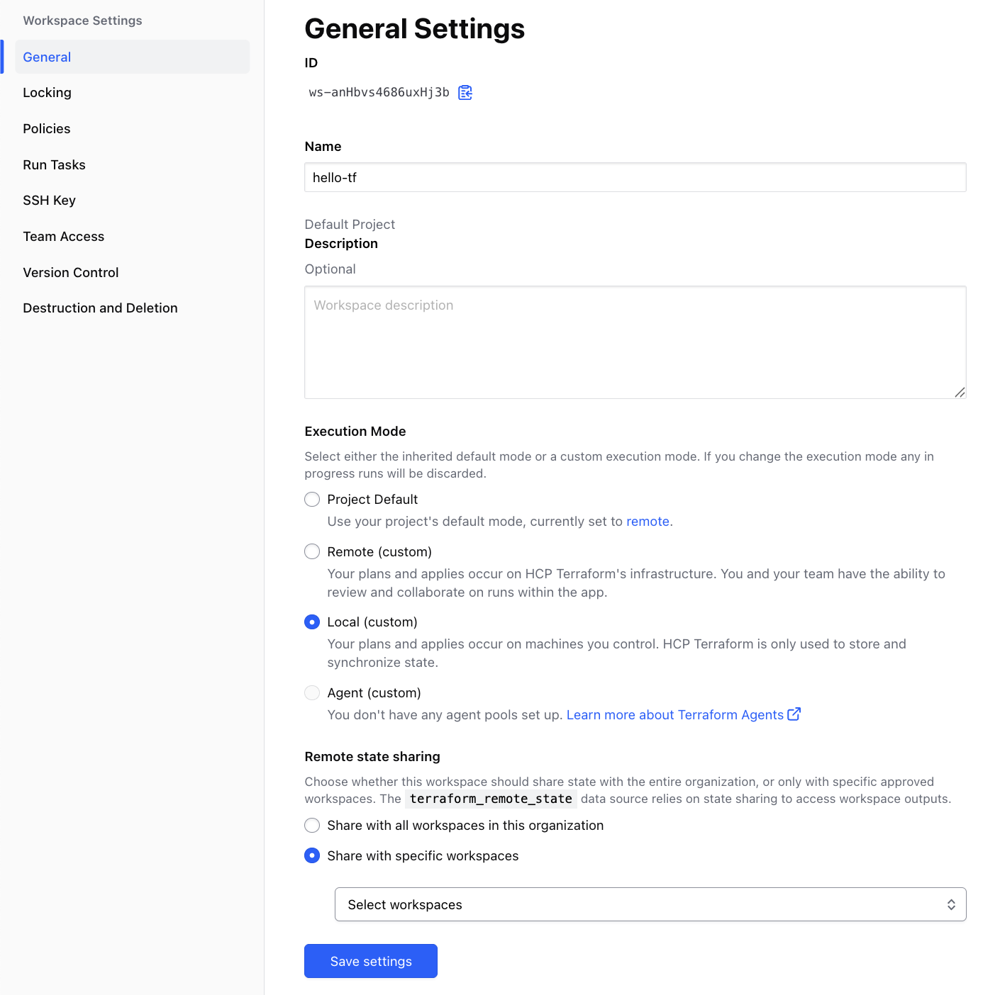
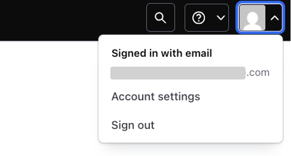

# Terraform Cloud によるリモートステート管理

さて、最初の Workshop では Local 環境で Terraform を実行し、State ファイルも Local 環境に作成されました。

State ファイルは非常に重要なファイルで様々な情報がつまっています。
- Provisioning された Resource の識別情報
- API キーやパスワードなどの Secret
- など

Terraform で継続的に Provisioning を行なうためには State ファイルの管理が必至です。Terraform はデフォルトの挙動として、実行されて得た State ファイルを Local 環境に保存します。ただ、Local 環境で State ファイルを管理するにはいくつかの問題があります。
- 個人の Local 環境だけに存在すると、チームでの作業が出来ない
  - 例えば A さんのローカルマシン上にだけ State ファイルがある場合、A さん以外の人はその環境にたいして、それ以上の Provisioning が出来ない。
- 誤って削除してしまうと元に戻せない（よって全てのインフラ情報が損失してしまう）
  - 既存の環境を State ファイルに取り込む import というコマンドもありますが、非常に手間と時間がかかります。
- State ファイルは常に最後の Terraform 実行の情報だけが記載されるので、過去のインフラ状態のトラッキングが出来ない
  - トラッキングのために、Terraform の実行毎に State ファイルを共有スペース（ファイルサーバーや S3 など）や VCS などに保存するやり方もありますが、手間がかかります。

そこで、Terraform OSS のユーザーはこれらの問題を回避するために様々な仕組みをカスタムしてきました。ただ、これらのカスタマイズは各ユーザー側の開発・メンテナンスなどを必要とし、その管理のために本来の仕事とは別の時間を費やしてしまいます。

Terraform Cloud 及び Terraform Enterprise にはこれらの問題を解決すべく、様々な Team collaboration 及び Governance の機能を予め用意してあります。これからの Workshop では、これら機能を紹介していきます。

## 事前準備

1. この Workshop を行なうには Terraform Cloud のアカウントが必要です。こちらからサインアップをしてください。（すでにアカウントをお持ちの方はスキップしてください。）

[https://app.terraform.io/signup/account](https://app.terraform.io/signup/account)

## リモートステート管理機能

Terraform Cloud には Remote State 管理機能があります。ちなみに、**この機能は誰でも無料で利用できます**。

ここでは、Remote State 管理機能を使うエクササイズを行います。


### Organization の設定

Terraform Cloud にログインし、新規 Organization を作成します。

すでに Organization を作ってる人はこの手順をスキップしてください。
Organization は、ユーザや、チームや、Workcpace を束ねて扱う事ができる最上位単位です。

<kbd>
  
</kbd>

`＋ create organization` ボタンを押して詳細を入力します。

<kbd>
  
</kbd>


`Terraform organization name`　には、unique な名前を設定します。
数字、文字、アンダースコア (_)、ハイフン (-)が利用できます。

入力したら、メールアドレスを入力して、 `create organization` ボタンを押したら Organization が作成されます。
メールアドレスはログインした情報を元に自動で入力されています。

<kbd>
  
</kbd>

### Workspace の設定

Organization を作成したら、新規 Workspace を作成します。
ワークスペース名は任意で構いません。

**1 つの Organization 内では全ての Workspace 名が一意である必要がありますので、複数のユーザーで作業する場合、Workspace 名がユニークになるようにしてください。**

Workspace は以下の `Create a workspace` ボタンより作成できます。


以下の画面で、**CLI Drive Workflow**を選択してください。

<kbd>
  
</kbd>

ここでは、ワークスペース名は**hello-tf**とします。
併せて、Workspace を作成する Project を選択します。

Project を独自に作っている人は任意の Project を選択し、
初めて利用する人は最初から作られている **Default Project** のまま進んでください。

**Create** ボタンを押すと Workspace が作成されます。

<kbd>
  
</kbd>

つぎに作成したワークスペースの Settings メニューから以下の操作を実施して下さい。

```
* Settings > General ナビゲートし、Execution modeをLocalに設定
* Save Settingsを選択して保存
```

<kbd>
  
</kbd>

Execution mode を**Local**に設定すると、Terraform の実行は Local 環境で行いますが、作成される State ファイルは Terraform Cloud に保存されます。

### User Token の作成

さて、次に Local の Terraform 環境から Terraform Cloud にアクセスするために、User token を作成します。
この User token はローカル環境や別のシステム（CI/CD パイプラインや外部ツールなど）から Terraform Cloud API を叩く際に必要となります。

右上の自分のアイコンをクリックして **Account settings** を選択します。

<kbd>
  
</kbd>

そこから、**Tokens** メニューから **Create an API Token** ボタンで User Token を作成します。

<kbd>
  
</kbd>

ダイアログが表示されるので、
Description にはこの Token についての説明を追加します。
ここでは **for workshop** などとしておくと workshop 用途で使った token である事を後から判別できます。
入力したら **Generate token** ボタンを押して Token を作成します。

<kbd>
  
</kbd>

Tokens の一覧に、作成した Token が表示されます。
作成されたばかりの Token には、Token の文字列が表示されています。（キャプチャの灰色部分です）
作成された Token は画面遷移するともう表示されないので、必ず安全なところへコピーして控えておいてください。

<kbd>
  
</kbd>


次に、ここで作成された Token を Local 環境の設定ファイルに登録します。`terraform login` コマンドを使います。Token は `~/.terraform.d/credentials.tfrc.json `に保存されます。
**Windows の場合、%APPDATA%\terraform.rc となります。**

**Token for app.terraform.io:** と聞かれたら、Token をペーストします。

```console
$ cd path/to/hello-tf
$ terraform login
Terraform will request an API token for app.terraform.io using your browser.

If login is successful, Terraform will store the token in plain text in
the following file for use by subsequent commands:
    /Users/<YOUR_NAME>/.terraform.d/credentials.tfrc.json

Do you want to proceed?
  Only 'yes' will be accepted to confirm.

  Enter a value: yes


---------------------------------------------------------------------------------

Terraform must now open a web browser to the tokens page for app.terraform.io.

If a browser does not open this automatically, open the following URL to proceed:
    https://app.terraform.io/app/settings/tokens?source=terraform-login


---------------------------------------------------------------------------------

Generate a token using your browser, and copy-paste it into this prompt.

Terraform will store the token in plain text in the following file
for use by subsequent commands:
    /Users/<YOUR_NAME>/.terraform.d/credentials.tfrc.json

Token for app.terraform.io:
  Enter a value:


Retrieved token for user <YOUR_ACCOUNT>
```

これで Local 環境から Terraform Cloud の API にアクセスする準備が整いました。

### Remote Backend の設定

つぎに Terraform に Remote Backend を使用するコードを追加します。`main.tf` の `terraform` スタンザを以下のように変更してください。*YOUR_ORGANIZATION* は使用している Organization の値に置き換えてください。

```hcl
terraform {
#ここから
  cloud {
    organization = "YOUR_ORGANIZATION"

    workspaces {
      name = "hello-tf"
    }
  }
#ここまで追加
}
```

ここまでの準備が出来ましたら、Terraform を実行します。
`terraform init` コマンドを実行してください。

```console
% terraform init
Initializing HCP Terraform...
Migrating from backend "remote" to HCP Terraform.
Initializing provider plugins...
- Reusing previous version of hashicorp/aws from the dependency lock file
- Using previously-installed hashicorp/aws v6.12.0

HCP Terraform has been successfully initialized!

You may now begin working with HCP Terraform. Try running "terraform plan" to
see any changes that are required for your infrastructure.

If you ever set or change modules or Terraform Settings, run "terraform init"
again to reinitialize your working directory.
```

**Migrating from backend "remote" to HCP Terraform.** と表示されているのが確認できます。

実際に state ファイルを Terraform cloud の remote で管理するには `terraform apply` による実行が必要です。

```console
$ terraform apply
```

この段階で、Terraform Cloud の Workspace を確認すると、State ファイルが作成されているはずです。

<kbd>
  
</kbd>

中を見てみると先ほど作成した環境のステートが記述されているはずです。

<kbd>
  
</kbd>

### 環境のクリーンアップ

次に`destroy`で環境をリセットします。

```shell
$ terraform destroy
```
実行中にステートレポジトリの GUI を見るとロックがかかっていることがわかります。

<kbd>
  
</kbd>

実行ししばらくすると EC2 インスタンスが `terminated` の状態になってることがわかるはずです。(GCP/Azure の場合は Web ブラウザから確認してください。)

```console
$ aws ec2 describe-instances --query "Reservations[].Instances[].{InstanceId:InstanceId,State:State}"
[
    {
        "InstanceId": "i-0988a3fc4de8f2980",
        "State": {
            "Code": 48,
            "Name": "terminated"
        }
    },
    {
        "InstanceId": "i-0b22f0bca411f88cb",
        "State": {
            "Code": 48,
            "Name": "terminated"
        }
    }
]
```

この `destroy` では Local の State ファイルではなく、Terraform Cloud 上の State ファイルを使用します。よって、もう Local の State ファイルは必要ないので削除しても構いません。

再度 Terraform Cloud の GUI からステートファイルを確認してください。変更が反映されることがわかるはずです。

<kbd>
  
</kbd>

## まとめ

これで Remote Backend の設定は完了です。ここでのエクササイズでは、個人個人で Workspace を作りましたが、これをチームで共有することで State ファイルの共有が実現できます。

ただ、State ファイルの共有が実現できたとしてもまだまだチーム利用としては足りない機能が多々あります。それらを次からの Workshop で見ていきたいと思います。
