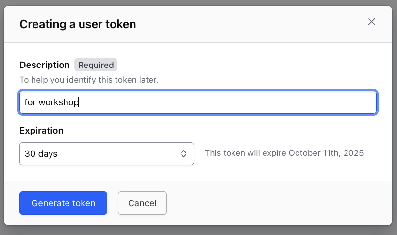
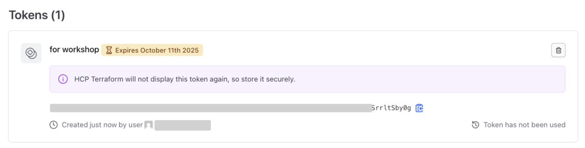

# Terraform CloudによるRemote state管理

さて、最初のWorkshopではLocal環境でTerraformを実行し、StateファイルもLocal環境に作成されました。

Stateファイルは非常に重要なファイルで様々な情報がつまっています。
- ProvisioningされたResourceの識別情報
- APIキーやパスワードなどのSecret
- など

Terraformで継続的にProvisioningを行なうためにはStateファイルの管理が必至です。Terraformはデフォルトの挙動として、実行されて得たStateファイルをLocal環境に保存します。ただ、Local環境でStateファイルを管理するにはいくつかの問題があります。
- 個人のLocal環境だけに存在すると、チームでの作業が出来ない
  - 例えばAさんのローカルマシン上にだけStateファイルがある場合、Aさん以外の人はその環境にたいして、それ以上のProvisioningが出来ない。
- 誤って削除してしまうと元に戻せない（よって全てのインフラ情報が損失してしまう）
  - 既存の環境をStateファイルに取り込むimportというコマンドもありますが、非常に手間と時間がかかります。
- Stateファイルは常に最後のTerraform実行の情報だけが記載されるので、過去のインフラ状態のトラッキングが出来ない
  - トラッキングのために、Terraformの実行毎にStateファイルを共有スペース（ファイルサーバーやS3など）やVCSなどに保存するやり方もありますが、手間がかかります。

そこで、Terraform OSSのユーザーはこれらの問題を回避するために様々な仕組みをカスタムしてきました。ただ、これらのカスタマイズは各ユーザー側の開発・メンテナンスなどを必要とし、その管理のために本来の仕事とは別の時間を費やしてしまいます。

Terraform Cloud及びTerraform Enterpriseにはこれらの問題を解決すべく、様々なTeam collaboration及びGovernanceの機能を予め用意してあります。これからのWorkshopでは、これら機能を紹介していきます。

## 事前準備
---

1. このWorkshopを行なうにはTerraform Cloudのアカウントが必要です。こちらからサインアップをしてください。（すでにアカウントをお持ちの方はスキップしてください。）

[https://app.terraform.io/signup/account](https://app.terraform.io/signup/account)

## Remote State管理機能
---

Terraform cloudにはRemote State管理機能があります。ちなみに、**この機能は誰でも無料で利用できます**。

ここでは、Remote State管理機能を使うエクササイズを行います。

### Workspaceの設定
---

Terraform Cloudにログインし、新規Workspaceを作成します。
ワークスペース名は任意で構いません。

**1つのOrganization内では全てのWorkspace名が一意である必要がありますので、複数のユーザーで作業する場合、Workspace名がユニークになるようにしてください。**

Workspaceは以下のボタンより作成できます。


以下の画面で、**No VCS Connection**を選択してください。

<kbd>
  
</kbd>

- Workspace名にには重複しない任意の名前をつけてください。以下、このページでは、ここで指定した名前を*YOURWORKSPACE*という置き換え表示で表します。

つぎに、Workspaceの**Setting > General >** にナビゲートし、Execution modeを**Local**に設定して保存してください。

<kbd>
  
</kbd>

Execution modeを**Local**に設定すると、Terrarormの実行はLocal環境で行いますが、作成されるStateファイルはTerraform cloudに保存されます。

### User Tokenの作成
---

さて、次にLocalのTerraform環境からTerraform Cloudにアクセスするために、User tokenを作成します。このUser tokenはローカル環境や別のシステム（CI/CDパイプラインや外部ツールなど）からTerraform Cloud APIを叩く際に必要となります。

右上の自分のアイコンをクリックして**User setting**を選択します。

<kbd>
  
</kbd>

そこから、**Token**メニューから**Generate Token**ボタンでUser Tokenを作成します。DescriptionにはこのTokenについてｒの說明を追加できます。

<kbd>
  
</kbd>

作成されたTokenはこの画面でしか表示されないので、必ずコピーもしくはDownloadしておいてください。

<kbd>
  
</kbd>

### Terraformバージョンの指定
```
* トップ画面からワークスペースを選択
* Settingsを選択
* Terraform バージョンを0.12.31に指定
* Save Settingsを選択
```

次に、ここで作成されたTokenをLocal環境の設定ファイルに登録します。`terraform login` コマンドを使います。Tokenは `~/.terraform.d/credentials.tfrc.json `に保存されます。
**Windowsの場合、%APPDATA%\terraform.rcとなります。**

```shell
cd  ../hello-tf
terraform login

Terraform will request an API token for app.terraform.io using your browser.

If login is successful, Terraform will store the token in plain text in
the following file for use by subsequent commands:
    /Users/masa/.terraform.d/credentials.tfrc.json

Do you want to proceed? (y/n) y
Terraform must now open a web browser to the tokens page for app.terraform.io.

If a browser does not open this automatically, open the following URL to proceed:
    https://app.terraform.io/app/settings/tokens?source=terraform-login


---------------------------------------------------------------------------------

Generate a token using your browser, and copy-paste it into this prompt.

Terraform will store the token in plain text in the following file
for use by subsequent commands:
    /Users/masa/.terraform.d/credentials.tfrc.json

Token for app.terraform.io: 

Retrieved token for user masa_hashicorp


---------------------------------------------------------------------------------

Success! Terraform has obtained and saved an API token.
```

これでLocal環境からTerraform CloudのAPIにアクセスする準備が整いました。

### Remote Backendの設定
---

つぎにTerraformにRemote Backendを使用するコードを追加します。以下のコードを```remote_backend.tf```という名前で作成してください。*YOURORGANIZATION*は使用しているOrganizationの値に、*YOURWORKSPACE*は使用しているWorkspaceに置き換えてください。

```hcl
terraform {
  backend "remote" {
    hostname = "app.terraform.io"
    organization = "YOURORGANIZATION"
    workspaces {
      name = "YOURWORKSPACE"
    }
  }
}
```

ここまでの準備が出来ましたら、Terraformを実行します。以下のコマンドを実行してください。

```
terraform init
```

ここで、もし直前のWorkshopで作成されたStateファイルが存在していると以下のように、「既存StateファイルをRemote Backendにコピーするか？」と尋ねられます。*Yes* と入力して下さい。

```console
# terraform init

Initializing the backend...
Do you want to copy existing state to the new backend?
  Pre-existing state was found while migrating the previous "local" backend to the
  newly configured "remote" backend. No existing state was found in the newly
  configured "remote" backend. Do you want to copy this state to the new "remote"
  backend? Enter "yes" to copy and "no" to start with an empty state.

  Enter a value: yes


Successfully configured the backend "remote"! Terraform will automatically
use this backend unless the backend configuration changes.
```

この段階で、Terraform cloudのWorkspaceを確認すると、Stateファイルが作成されているはずです。

<kbd>
  
</kbd>

それでは```apply```してみましょう。

```
rm terraform.tfstate.backup .terraform/terraform.tfstate rm terraform.tfstate.backup
terraform apply
```

この```apply```ではLocalのStateファイルではなく、Terraform cloud上のStateファイルを使用します。よって、もうLocalのStateファイルは必要ないので削除しても構いません。

再度Terraform CloudのGUIからステートファイルを確認してください。変更が反映されることがわかるはずです。

## まとめ

これでRemote Backendの設定は完了です。ここでのエクササイズでは、個人個人でWorkspaceを作りましたが、これをチームで共有することでStateファイルの共有が実現できます。

ただ、Stateファイルの共有が実現できたとしてもまだまだチーム利用としては足りない機能が多々あります。それらを次からのWorkshopで見ていきたいと思います。
