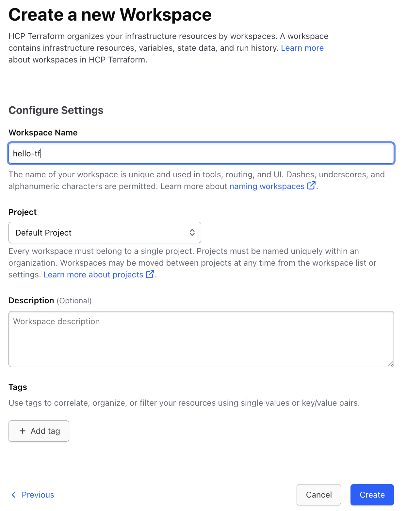

# Terraform Cloudによるリモートステート管理

さて、最初のWorkshopではLocal環境でTerraformを実行し、StateファイルもLocal環境に作成されました。

Stateファイルは非常に重要なファイルで様々な情報がつまっています。
- ProvisioningされたResourceの識別情報
- APIキーやパスワードなどのSecret
- など

Terraformで継続的にProvisioningを行なうためにはStateファイルの管理が必至です。Terraformはデフォルトの挙動として、実行されて得たStateファイルをLocal環境に保存します。ただ、Local環境でStateファイルを管理するにはいくつかの問題があります。
- 個人のLocal環境だけに存在すると、チームでの作業が出来ない
  - 例えばAさんのローカルマシン上にだけStateファイルがある場合、Aさん以外の人はその環境にたいして、それ以上のProvisioningが出来ない。
- 誤って削除してしまうと元に戻せない（よって全てのインフラ情報が損失してしまう）
  - 既存の環境をStateファイルに取り込むimportというコマンドもありますが、非常に手間と時間がかかります。
- Stateファイルは常に最後のTerraform実行の情報だけが記載されるので、過去のインフラ状態のトラッキングが出来ない
  - トラッキングのために、Terraformの実行毎にStateファイルを共有スペース（ファイルサーバーやS3など）やVCSなどに保存するやり方もありますが、手間がかかります。

そこで、Terraform OSSのユーザーはこれらの問題を回避するために様々な仕組みをカスタムしてきました。ただ、これらのカスタマイズは各ユーザー側の開発・メンテナンスなどを必要とし、その管理のために本来の仕事とは別の時間を費やしてしまいます。

Terraform Cloud及びTerraform Enterpriseにはこれらの問題を解決すべく、様々なTeam collaboration及びGovernanceの機能を予め用意してあります。これからのWorkshopでは、これら機能を紹介していきます。

## 事前準備

1. このWorkshopを行なうにはTerraform Cloudのアカウントが必要です。こちらからサインアップをしてください。（すでにアカウントをお持ちの方はスキップしてください。）

[https://app.terraform.io/signup/account](https://app.terraform.io/signup/account)

## リモートステート管理機能

Terraform CloudにはRemote State管理機能があります。ちなみに、**この機能は誰でも無料で利用できます**。

ここでは、Remote State管理機能を使うエクササイズを行います。


### Organizationの設定

Terraform Cloudにログインし、新規Organizationを作成します。

すでにOrganizationを作ってる人はこの手順をスキップしてください。
Organizationは、ユーザや、チームや、Workcpaceを束ねて扱う事ができる最上位単位です。

<kbd>
  
</kbd>

`＋ create organization` ボタンを押して詳細を入力します。

<kbd>
  
</kbd>
  
  
`Terraform organization name`　には、uniqueな名前を設定します。
数字、文字、アンダースコア (_)、ハイフン (-)が利用できます。

入力したら、メールアドレスを入力して、 `create organization` ボタンを押したらOrganizationが作成されます。
メールアドレスはログインした情報を元に自動で入力されています。

<kbd>
  
</kbd>

### Workspaceの設定

Organizationを作成したら、新規Workspaceを作成します。
ワークスペース名は任意で構いません。

**1つのOrganization内では全てのWorkspace名が一意である必要がありますので、複数のユーザーで作業する場合、Workspace名がユニークになるようにしてください。**

Workspaceは以下の `Create a workspace` ボタンより作成できます。


以下の画面で、**CLI Drive Workflow**を選択してください。

<kbd>
  
</kbd>

ここでは、ワークスペース名は**hello-tf**とします。
併せて、Workspaceを作成するProjectを選択します。

Projectを独自に作っている人は任意のProjectを選択し、
初めて利用する人は最初から作られている **Default Project** のまま進んでください。

**Create** ボタンを押すとWorkspaceが作成されます。

<kbd>
  
</kbd>

つぎに作成したワークスペースのSettingsメニューから以下の操作を実施して下さい。

```
* Settings > General ナビゲートし、Execution modeをLocalに設定
* Save Settingsを選択して保存
```

<kbd>
  
</kbd>

Execution modeを**Local**に設定すると、Terraformの実行はLocal環境で行いますが、作成されるStateファイルはTerraform Cloudに保存されます。

### User Tokenの作成

さて、次にLocalのTerraform環境からTerraform Cloudにアクセスするために、User tokenを作成します。  
このUser tokenはローカル環境や別のシステム（CI/CDパイプラインや外部ツールなど）からTerraform Cloud APIを叩く際に必要となります。

右上の自分のアイコンをクリックして**Account settings**を選択します。

<kbd>
  
</kbd>

そこから、**Tokens**メニューから**Create an API Token**ボタンでUser Tokenを作成します。

<kbd>
  
</kbd>

ダイアログが表示されるので、
DescriptionにはこのTokenについての説明を追加します。  
ここでは **for workshop** などとしておくとworkshop用途で使ったtokenである事を後から判別できます。
入力したら **Generate token** ボタンを押してTokenを作成します。
  
<kbd>
  
</kbd>

Tokensの一覧に、作成したTokenが表示されます。
作成されたばかりのTokenには、Tokenの文字列が表示されています。（キャプチャの灰色部分です）
作成されたTokenは画面遷移するともう表示されないので、必ず安全なところへコピーして控えておいてください。
  
<kbd>
  
</kbd>


次に、ここで作成されたTokenをLocal環境の設定ファイルに登録します。`terraform login` コマンドを使います。Tokenは `~/.terraform.d/credentials.tfrc.json `に保存されます。
**Windowsの場合、%APPDATA%\terraform.rcとなります。**

**Token for app.terraform.io:** と聞かれたら、Tokenをペーストします。

```console
$ cd path/to/hello-tf
$ terraform login
Terraform will request an API token for app.terraform.io using your browser.

If login is successful, Terraform will store the token in plain text in
the following file for use by subsequent commands:
    /Users/<YOUR_NAME>/.terraform.d/credentials.tfrc.json

Do you want to proceed?
  Only 'yes' will be accepted to confirm.

  Enter a value: yes


---------------------------------------------------------------------------------

Terraform must now open a web browser to the tokens page for app.terraform.io.

If a browser does not open this automatically, open the following URL to proceed:
    https://app.terraform.io/app/settings/tokens?source=terraform-login


---------------------------------------------------------------------------------

Generate a token using your browser, and copy-paste it into this prompt.

Terraform will store the token in plain text in the following file
for use by subsequent commands:
    /Users/<YOUR_NAME>/.terraform.d/credentials.tfrc.json

Token for app.terraform.io:
  Enter a value:


Retrieved token for user <YOUR_ACCOUNT>
```

これでLocal環境からTerraform CloudのAPIにアクセスする準備が整いました。

### Remote Backendの設定

つぎにTerraformにRemote Backendを使用するコードを追加します。`main.tf`の`terraform`スタンザを以下のように変更してください。*YOUR_ORGANIZATION*は使用しているOrganizationの値に置き換えてください。

```hcl
terraform {
#ここから
  cloud {
    organization = "YOUR_ORGANIZATION"

    workspaces {
      name = "hello-tf"
    }
  }
#ここまで追加
}
```

ここまでの準備が出来ましたら、Terraformを実行します。
`terraform init` コマンドを実行してください。

```console
% terraform init
Initializing HCP Terraform...
Migrating from backend "remote" to HCP Terraform.
Initializing provider plugins...
- Reusing previous version of hashicorp/aws from the dependency lock file
- Using previously-installed hashicorp/aws v6.12.0

HCP Terraform has been successfully initialized!

You may now begin working with HCP Terraform. Try running "terraform plan" to
see any changes that are required for your infrastructure.

If you ever set or change modules or Terraform Settings, run "terraform init"
again to reinitialize your working directory.
```

**Migrating from backend "remote" to HCP Terraform.** と表示されているのが確認できます。

実際にstateファイルをTerraform cloudのremoteで管理するには `terraform apply` による実行が必要です。

```console
$ terraform apply
```

この段階で、Terraform CloudのWorkspaceを確認すると、Stateファイルが作成されているはずです。

<kbd>
  
</kbd>

中を見てみると先ほど作成した環境のステートが記述されているはずです。

<kbd>
  
</kbd>

### 環境のクリーンアップ

次に`destroy`で環境をリセットします。

```shell
$ terraform destroy 
```
実行中にステートレポジトリのGUIを見るとロックがかかっていることがわかります。

<kbd>
  
</kbd>

実行ししばらくするとEC2インスタンスが`terminated`の状態になってることがわかるはずです。(GCP/Azureの場合はWebブラウザから確認してください。)

```console
$ aws ec2 describe-instances --query "Reservations[].Instances[].{InstanceId:InstanceId,State:State}"
[
    {
        "InstanceId": "i-0988a3fc4de8f2980",
        "State": {
            "Code": 48,
            "Name": "terminated"
        }
    },
    {
        "InstanceId": "i-0b22f0bca411f88cb",
        "State": {
            "Code": 48,
            "Name": "terminated"
        }
    }
]
```

この`destroy`ではLocalのStateファイルではなく、Terraform Cloud上のStateファイルを使用します。よって、もうLocalのStateファイルは必要ないので削除しても構いません。

再度Terraform CloudのGUIからステートファイルを確認してください。変更が反映されることがわかるはずです。

<kbd>
  
</kbd>

## まとめ

これでRemote Backendの設定は完了です。ここでのエクササイズでは、個人個人でWorkspaceを作りましたが、これをチームで共有することでStateファイルの共有が実現できます。

ただ、Stateファイルの共有が実現できたとしてもまだまだチーム利用としては足りない機能が多々あります。それらを次からのWorkshopで見ていきたいと思います。
